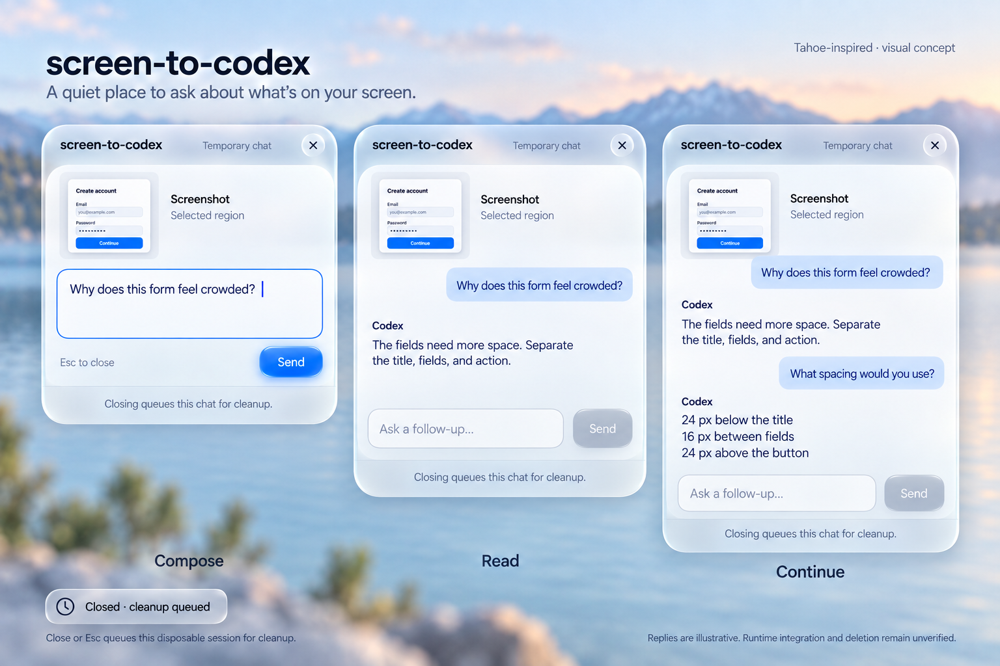

# Overlay visual refinement

Scope: static macOS concept, refining the approved eight-step storyboard.
Mode: Operate. Direction: light macOS Tahoe-inspired Liquid Glass utility.
This is design evidence, not a working UI or an accessibility/behavior pass.

Later implementation decisions supersede the concept where noted: press and
release the hotkey before dragging; close silently without a toast; use the app
icon and “Screen to Codex” in the header. The current composer also groups the
model and effort menus beside its accessible circular Send control.

The user requested Liquid Glass and softer rounded shapes after reviewing
the original refinement. `overlay-tahoe.png` is the current selected concept;
the earlier images are retained as prior directions. The material treatment
and proposed radii below supersede the original warm-white shell and 14 pt
outer radius. [Exact ImageGen prompt](overlay-tahoe-prompt.md).

The direction follows [Apple's AppKit Tahoe design guidance](https://developer.apple.com/videos/play/wwdc2025/310/):
glass emphasizes floating structure and controls, with coordinated corner
shapes. For implementation, prefer native materials and controls; the PNG
is an illustration, not a native render or evidence of an exact system radius.

The close-up sheet complements the approved eight-step storyboard. It does
not replace the selection, mouse-release, follow-up submission, or closing
steps. Generated with the built-in ImageGen tool using that storyboard as
the edit reference.

## Preserve

1. Press the configured hotkey, then click and hold, drag a region, and release.
   The shortcut keys do not need to remain held.
2. Mouse release opens the nearby composer with an attached thumbnail and
   focused input. No second shortcut or hover action.
3. Explicit Send creates one disposable Codex task.
4. Read responses and send follow-ups in that same floating conversation.
5. Closing or Esc ends the local session and queues its owned files and task
   for cleanup. Queued does not mean deletion has completed.

Keep the approved example question, follow-up, and answers. No app switching,
pet, saved-history sidebar, gallery, or confirmation dialog. The underlying
app remains visible and usable; selection dimming ends on mouse release.

## Refinement direction

- Smaller screenshot attachment: thumbnail plus a plain “Screenshot” label,
  rather than an oversized preview displacing the question or answer.
- Stable panel header, width, and anchor beside the capture. Grow vertically
  for the chat, subject to the available screen space.
- Plain assistant text with generous line height; a subtle blue tint identifies
  user messages. Avoid individual raised cards around every message.
- One consistent bottom composer with a clear focus ring and labelled Send
  button. Its size supports a sentence, not just a few words.
- Quiet header: screen-to-codex, Temporary chat, and a readily discoverable
  close control. Keep technical integration status outside the product UI.
- Clean macOS typography, consistent padding and restrained blue accents.
  Use Liquid Glass in the shell, header and controls, with a quieter backing
  behind transcript text. Coordinate softer panel, input and control corners;
  use circular close controls and rounded Send buttons. Honor system reduced
  transparency and increased contrast settings when implementing the material.
- Closing is silent. Cleanup runs in the background without a toast.

## Proposed implementation values

These are future implementation targets, not measurements verified from PNGs.

| Element | Target |
| --- | --- |
| Panel width | 400 pt, clamped to available screen space |
| Panel radius | Approximately 28 pt in this concept; prefer native system geometry |
| Main inset | 16 pt |
| Spacing | 4 / 8 / 12 / 16 / 24 pt |
| Chat body | System font, 14 pt, approximately 20 pt line height |
| Secondary labels | System font, 12 pt, readable contrast |
| Controls | At least 32 pt hit area; visible keyboard focus |
| Attachment | Compact 56 pt thumbnail with label |
| Color | Translucent light shell, pale readable content backing, charcoal text, cobalt action |

## State requirements for implementation

- Empty: focused input, disabled Send, attached screenshot visible.
- Sending/waiting: visible pending state; preserve the draft on failure.
- Reply: readable text; input remains available for the next question.
- Failure: concise error and retry action; no false success state.
- Closing: clear local UI state and persist only necessary cleanup metadata.
- Cleanup failure: retain pending work for bounded retries and next startup.

## Verification limits

The incumbent storyboard is the visual authority. Review is limited to visible
craft and preservation of its depicted flow. No live app, mouse/keyboard
behavior, VoiceOver, computed contrast, animation, performance, attachment
consumption, or task deletion is verified by these mockups. A production
UI/UX PASS is not available until those checks exist.

## Visual review

Baseline: approved storyboard generated in this task, file
`exec-9c93adda-abbb-4d81-885f-48e11510d728.png`.

An independent image-only reviewer identified competing storyboard typography,
drifting panel position/geometry, compressed conversation content with clipping,
and an ambiguous arrow-only Send control. The refinement addresses the overlay
itself with equal widths, a labelled attachment, plain assistant text, a full
unclipped exchange, and an explicit Send button. The original full-flow sheet
remains the reference for placement beside the selected region.

The close-up includes only default, focused, and disabled controls. Waiting,
failure, hover, keyboard traversal, and runtime cleanup still need implementation
and live verification. The PNG illustrates hierarchy; the numeric design
targets above must be implemented and measured separately.

Independent confirmation of the first refinement found all four visual issues
improved. It identified one wording defect: “Closing discards this temporary
chat” overstated completion. The final image changes all three panel footers
to “Closing queues this chat for cleanup.” A final visual self-check confirmed
that correction and preserved the remaining composition. No production grade
is claimed. `overlay-refined.png` is the preceding draft, retained for review;
`overlay-refined-v2.png` is the selected deliverable.

Final ImageGen edit prompt:

> Precise text-only edit of this screen-to-codex three-state UI concept. In the footer inside EACH OF THE THREE floating windows, replace the sentence 'Closing discards this temporary chat.' with exactly 'Closing queues this chat for cleanup.' Keep centered, same typography, color, spacing and size. This wording must change in all three panels. Preserve literally everything else: all other wording, labels, title, subtitles, messages, screenshot thumbnails, controls, colors, shadows, layout, sizes, neutral clock cleanup notification and its 'Closed · cleanup queued' text. Do not redesign, add, or remove any element. Only the three identical footer sentences change.
